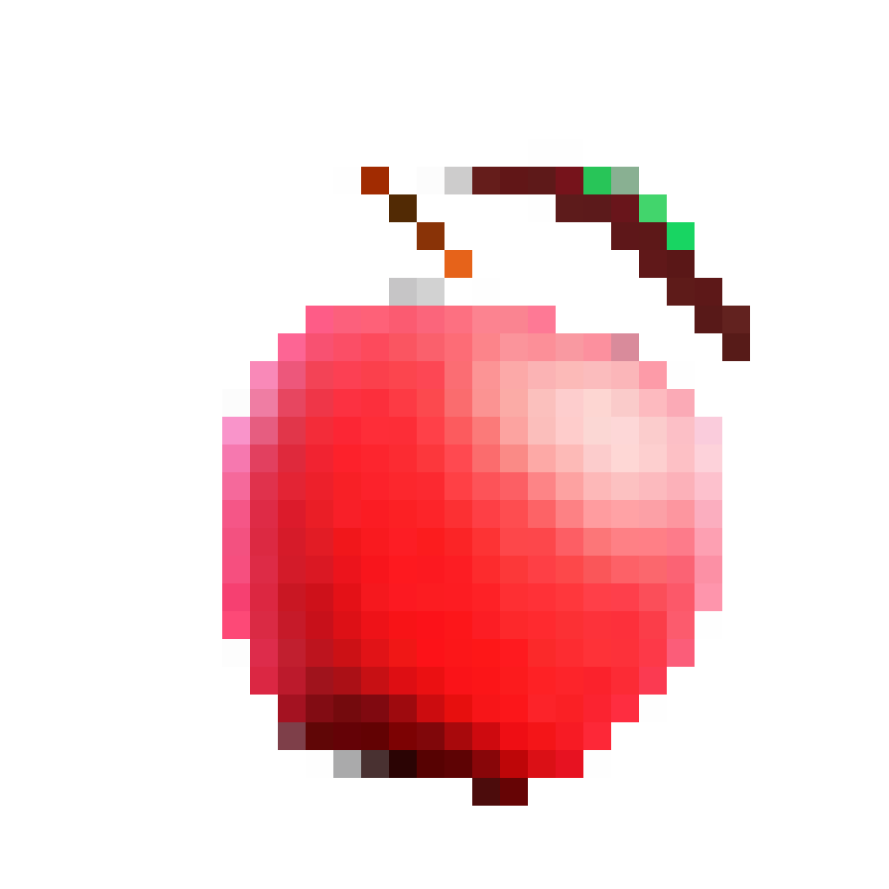
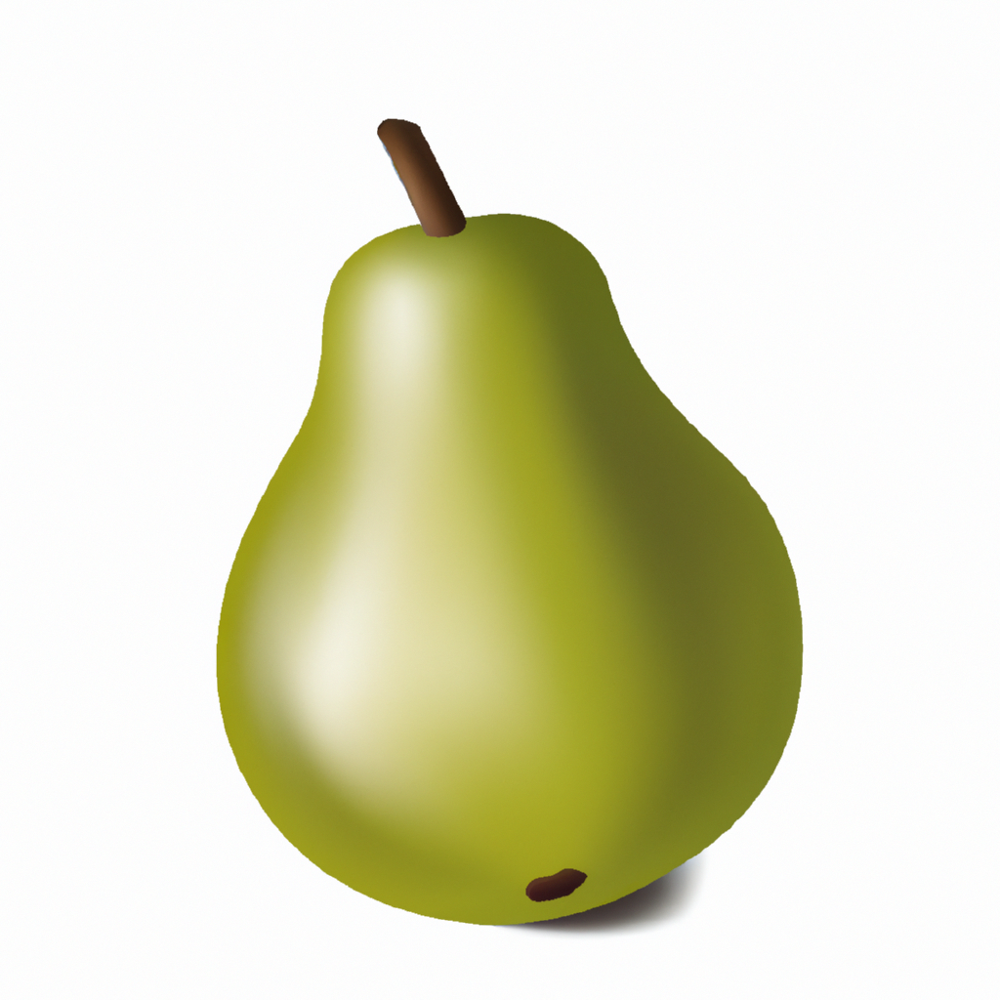
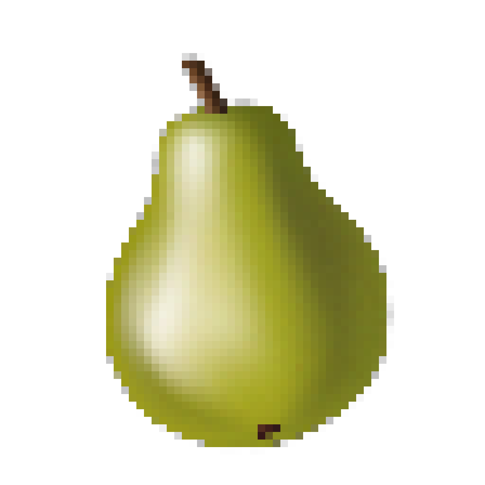

# Painless Pixel Art
Painless Pixel Art is a tool for creating simple pixel art objects.

## About
Generative AI has allowed for easy access to art generation for a variety of purposes. Asking generative AI to produce pixel art, however, results in a *stylised* output that is not represented with the appropriate number of pixels.

Painless Pixel Art addresses these issues by providing an interface to OpenAI's Dall-E 2 generative model that first generates requested imagery, and then removes the background and performs a simple downsampling operation.

The result is **true** pixel art.

## Getting started
To start using Painless Pixel Art follow the steps below.

### Prerequisites
Painless Pixel Art is implemented in Python 3.10+, which is the recommened usage version. To install Python 3.10+, visit [here](https://www.python.org/downloads/).

### Installation
To clone the repository and begin using Painless Pixel Art, follow these steps.
1. Clone the repository
```
git clone https://github.com/NedStickler/painless-pixel-art.git
```
2. Move into the repository
```
cd painless-pixel-art
```
3. Create a virtual environment in the repository
```
python -m venv venv
```
4. Activate the virtual environment. 
- On windows
```
.\venv\Scripts\activate
```
- On Unix or MaxOS
```
source venv/bin/activate
```
5. Install the package dependencies
```
pip install -r requirements.txt
```
6. Finally, generate an OpenAI API key to use for generating imagery. Guidance can be found [here](https://platform.openai.com/organization/api-keys).

## Usage
The following section provides an example of how to use the tool.

### OpenAI API key
There are two ways for Painless Pixel Art to access an OpenAI API key to begin generating images. The recommended way is to allow the class to automatically access the `OPENAI_API_KEY` environment variable. This can be done by permanently adding the secret key as an environment variable, or through the use of a `.env` file and the `dotenv` Python package. The following code provides an example of the latter.
```python
from generator import generator
from dotenv import load_dotenv

if __name__ == "__main__":
    load_dotenv("..")
    generator = Generator()
```
The second method involves manually fetching the environment variable. An example follows:
```python
import os
from generator import generator
from dotenv import load_dotenv

if __name__ == "__main__":
    load_dotenv("..")
    generator = Generator(api_key=os.getenv("OPENAI_API_KEY"))
```
**Note:** do not directly copy your OpenAI secret key into code. Take special care to ensure your secret keys are not published to any remote repositories.

### Examples
```python
from generate import Generator

if __name__ == "__main__":
    generator = Generator()
    generator.generate("a juicy red apple", "./assets/apple.png")
```

This code produces two files: the original generated image, and the pixel art version after downsampling. In the case for the above code, the original image is named `apple.png`, and the pixel art version is suffixed with `_ppa`, i.e. `apple_ppa.png`. The following images were produced by running the above code:

<p float="left" align="middle">
     
    
</p>

It is possible to change how the image is post-processed by updating the `postprocess_params` dictionary through the `update_postprocess_params` method.
```python
from generate import Generator

if __name__ == "__main__":
    generator = Generator()
    generator.update_postprocess_params({"dimensions": (64, 64)})
    generator.generate("a bright green pear", "./assets/pear.png")
```
The following images were produced by the above code, where the downsampled image is now 64x64 instead of 32x32.

<p float="left" align="middle">
     
    
</p>

## Additional information
This project was executed to gain familiarity with the OpenAI API, and is **unfinished**. There will be bugs!

There are future plans to turn Painless Pixel Art into a Python package.
